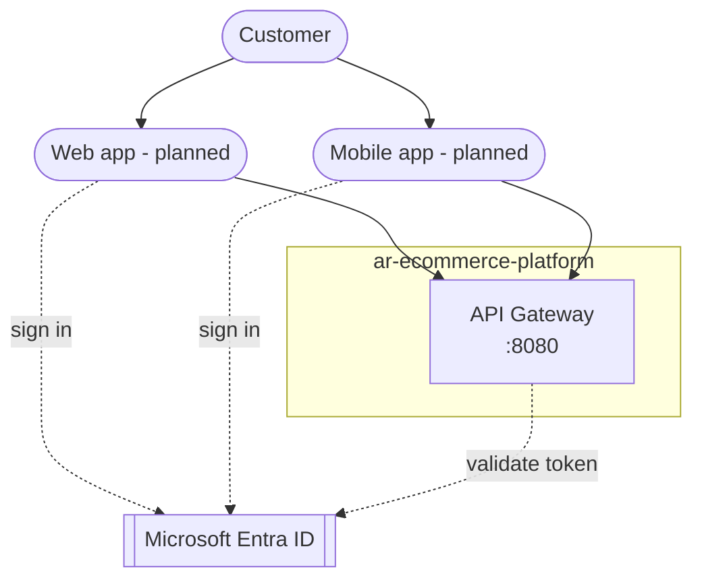
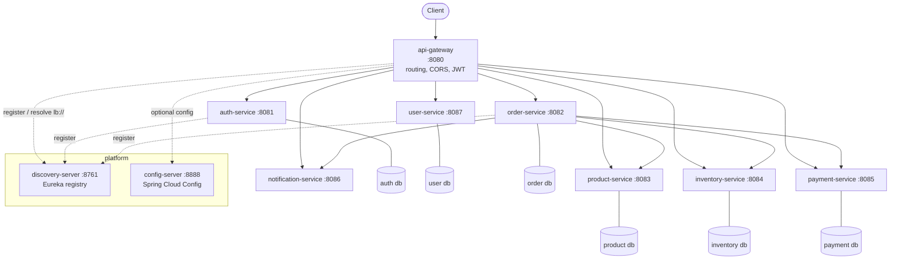
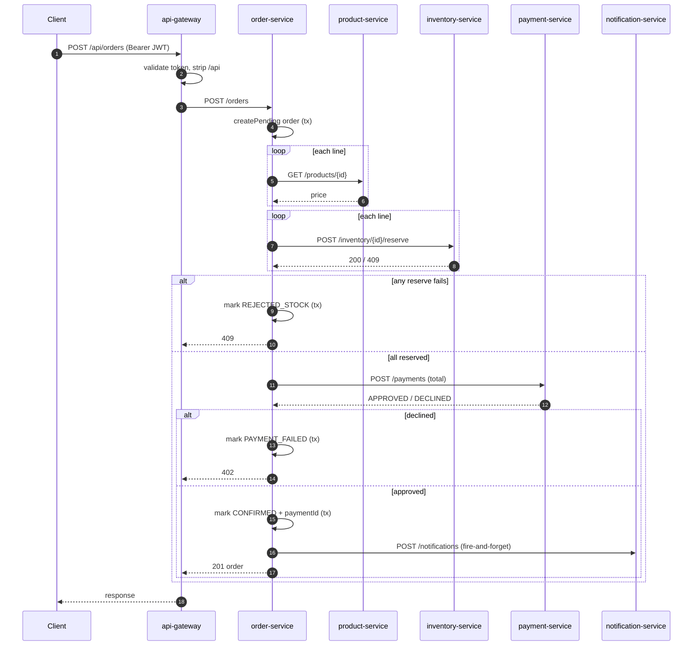

# Architecture

## 1. Context

Who uses the system and what it depends on.

- The only public entry point is the **API gateway**. Everything else is internal.
- Sign-in is either a **local account** (email + password, issued a JWT by `auth-service`) or
  **Microsoft Entra ID** ("Sign in with Microsoft 365"). The gateway accepts a token from either
  issuer; the Entra path is enabled by setting `ENTRA_ISSUER_URI`.
- The web and mobile clients are the next milestone; the API is already shaped for them
  (single origin, `/api/**` JSON, bearer auth, CORS).

## 2. Containers

Each box is a separately deployable service with its own database.

- **Discovery** — every service registers with Eureka; the gateway and `order-service` resolve
  `lb://<service>` addresses through it with client-side load balancing.
- **Config** — `config-server` serves shared settings from `config-repo` (native backend). Not
  load-bearing: every service also ships a self-contained `application.yml`, and imports from
  config-server as `optional:`.
- **Databases** — in-memory H2 locally (data resets on restart); PostgreSQL under the `prod`
  profile, one logical database per service (a service never reaches into another's tables).
- `notification-service` has no database — it holds notifications in memory (a demo stand-in for
  a broker consumer).

## 3. Placing an order

`order-service` is the orchestrator. One `POST /api/orders` fans out over HTTP:

**Why the persistence is split into small transactions.** The flow is *not* wrapped in one
`@Transactional` — that would (a) hold a database connection open across the external HTTP calls
and (b) roll back the `REJECTED_STOCK` / `PAYMENT_FAILED` audit record when the method throws.
Instead `OrderTransactions` exposes `createPending` / `markRejectedStock` / `markPaymentFailed` /
`confirm`, each its own short transaction. A Testcontainers integration test against real
PostgreSQL is what caught the original mistake.

**What it deliberately does not do (yet):** compensate an already-succeeded reservation when a
later line fails; retry; wrap the calls in a circuit breaker. These are the resilience follow-ups.

## 4. Cross-cutting

| Concern | How | Status |
|---|---|---|
| **AuthN** | JWT bearer. `auth-service` issues HS256 tokens (`iss`, `roles`). Gateway is an OAuth2 resource server with a multi-issuer resolver: local always, Entra when configured. | working; RS256 + JWKS is a planned upgrade |
| **AuthZ** | Gateway enforces "authenticated" on everything except `/api/auth/**` and `/actuator/**`. | per-user ownership checks (e.g. only your own orders) are a planned follow-up |
| **Config** | `config-server` (native backend) + per-service `application.yml` + env vars (highest precedence). | working |
| **Persistence** | JPA. Dev: in-memory H2 + `ddl-auto: update`. `prod`: PostgreSQL, Flyway migrations own the schema, Hibernate `validate` only. One database per service. | working (local overlay) |
| **Resilience** | 2s connect / 3s read timeouts on `order-service` clients; notification call is fire-and-forget. | timeouts only; retries + circuit breakers deferred |
| **Observability** | SLF4J + Spring Boot console logging; Actuator health/info. | structured JSON logs + correlation id + metrics/tracing deferred |
| **API docs** | springdoc OpenAPI per service (`/swagger-ui.html`, `/v3/api-docs`). | working |
| **Quality** | Spotless (google-java-format) + Checkstyle (cyclomatic complexity <= 10) + JaCoCo, vendored per repo. | build gates working |
| **CI/CD** | GitHub Actions per repo: `ci.yml` (build + test + lint on every push/PR, image to GHCR on `main`/`develop`) + gitleaks; weekly `security-scan.yml` (OWASP Dependency-Check). A nightly `e2e.yml` stands the stack up from GHCR images and runs the REST Assured suite. | written; runs on first push |
| **Testing** | Unit, `@WebMvcTest` slices, `@DataJpaTest` slices, Testcontainers integration (order-service), REST Assured e2e through the gateway. | working |

## 5. Runtime & deployment

- **Local (supported):** `docker compose -f infra/compose/docker-compose.yml up -d` — 10
  containers on one bridge network with health-gated startup ordering.
- **Local, no Docker:** `infra/scripts/run-local.ps1`.
- **Target:** a hosted demo on Azure or AWS — container registry, managed PostgreSQL, secrets in
  Key Vault / Secrets Manager, public HTTPS. Topology (single VM / managed containers / Kubernetes)
  is an open decision.

## 6. Deferred — the roadmap

1. Push to GitHub, then verify CI runs green (workflows are written: per-repo `ci.yml`, weekly
   `security-scan.yml`, nightly `e2e.yml`). Add SonarCloud + Snyk once accounts/secrets exist.
2. ~~PostgreSQL + `prod` profile + Flyway~~ — done for local (`docker-compose.postgres.yml`).
3. Cloud hosting (managed PostgreSQL, container registry, secrets store, public HTTPS).
4. Per-user authorization; RS256 + JWKS; forward `X-User-Id` downstream.
5. Resilience4j (retry, circuit breaker) + saga-style compensation.
6. Structured logging + correlation id + Prometheus/Grafana + distributed tracing.
7. Event-driven notifications (RabbitMQ / Kafka) replacing the synchronous call.
8. Web frontend (MSAL.js) and iOS/Android apps (MSAL).
9. Contract tests (Spring Cloud Contract / Pact), mutation testing (PITest), load tests (k6).
